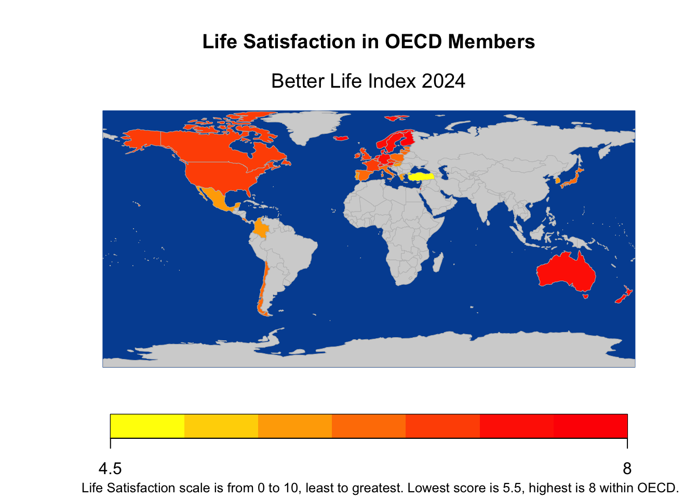

::: {.cell}
::: {.cell-output .cell-output-stdout}

```
38 codes from your data successfully matched countries in the map
0 codes from your data failed to match with a country code in the map
205 codes from the map weren't represented in your data
```


:::

::: {.cell-output-display}
{width=672}
:::
:::


## **Analysis**

The standard of a good or better well-being of a country may be undefinable, however, the OECD Better Life Index (BLI) has proven to be an accountable index to represent and visualize a nation's well-being. The data was sourced from a data set which used data originally from the OECD and IMF (2024). Then, mapping data was used to visualize the correlations between the GDP per capita and other variables of BLI, thus the BLI visualized around the world. The visualization indicates that Northern European and Oceania countries represented the highest BLI, and the GDP per capita has been positively correlated with variables of the BLI.

